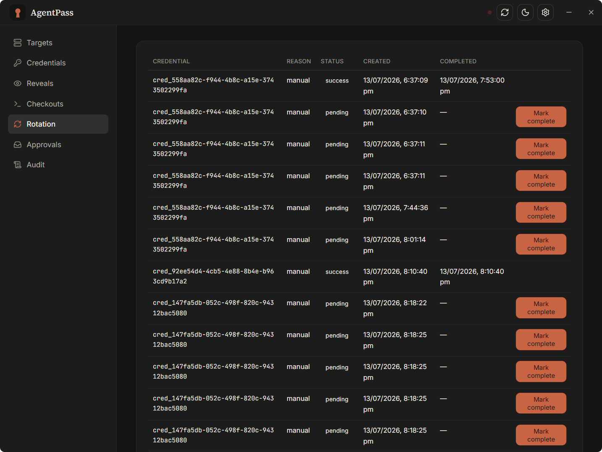
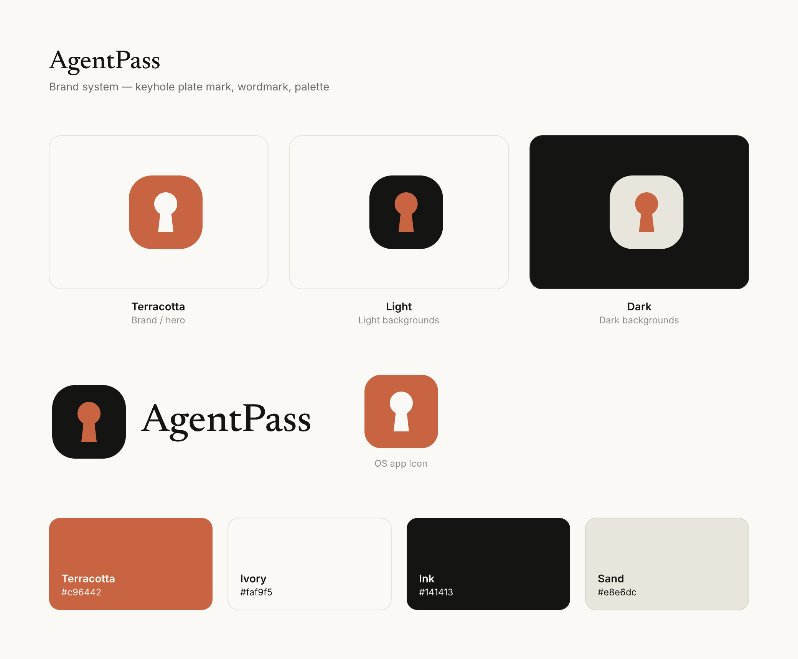

<div align="center">


### Give your AI agents scoped, audited, expiring access to your servers — never a pasted secret.

[](https://github.com/sooua/agentpass/releases)
[](https://github.com/sooua/agentpass/actions/workflows/release.yml)
[](LICENSE)
[](#install)

**English** · [中文](README.zh-CN.md)

</div>

---

**AgentPass** is a local-first credential manager built for the age of autonomous coding agents. Claude Code, Codex, and Cursor Agent can log into your servers through it — with a temporary key that expires, not a long-lived secret dumped into a chat log. Every access is scoped to what that agent may touch, attributed to its identity, and written to an append-only audit trail. Nothing leaves your machine.

<div align="center">

</div>

## Why AgentPass

Handing an AI agent a raw SSH key or database password is a one-way door: the secret is now in a transcript, a shell history, a model's context. AgentPass closes that door. The agent asks for *access*, gets a credential that dies on a timer, and never holds your long-term secret at all.

- **Checkout, not reveal.** The default path issues a temporary, expiring `ssh` command. The private key is materialized locally for the session and wiped on expiry — the agent never receives it.
- **Least privilege by identity.** Each agent carries a scoped token limited by capability, environment, and target. Overreach is rejected before the request runs, and the audit log names the token, not a self-reported string.
- **Deliberate high-risk path.** Plaintext reveal still exists for the cases that need it — audited, rotation-aware, and gated behind approval with enforced separation of duties.
- **Local by default.** SQLite at rest, AES-256-GCM secret blobs, a 0600 master key, OS-level file ACLs, redacted logs. No cloud account, no telemetry.

## Features

| | |
|---|---|
| **🔑 Credential checkout** | Temporary, expiring SSH access via the system OpenSSH client. Long-term keys never leave the vault. |
| **🎫 Scoped agent tokens** | Per-agent tokens at two levels: **Standard** (reveal · checkout · list · rotate across all targets) or **Root** (adds `admin`). Scope is enforced before the handler and attributed by identity. |
| **👁 Audited reveal** | Plaintext access when you truly need it — every call logged, secrets redacted, rotation triggered by policy. |
| **✅ Approval with separation of duties** | Gate high-risk reveals behind human approval; a requester can never approve its own request. |
| **♻️ Rotation** | Rotate after reveal, after N reveals, or on a schedule. Approval-aware manual flow; opt-in auto-rotation. |
| **🔄 End-to-end encrypted sync** | Cross-device sync over local dir, GitHub Gist, WebDAV, or S3 — secrets are encrypted before they leave the host. |
| **🧩 Adapter-first** | Clean provider ports so OpenBao, Infisical, Warpgate, or JumpServer can slot in without touching business logic. |
| **🖥 Native desktop** | Tauri 2 + React app for macOS, Windows, and Linux, with signed in-app updates. |

<div align="center">
<table>
<tr>
<td width="50%"><br/><sub><b>Scoped agent tokens</b> — Standard or Root, enforced before the handler.</sub></td>
<td width="50%"><br/><sub><b>Rotation</b> — after reveal, after N reveals, or on a schedule.</sub></td>
</tr>
</table>
<sub>Warm light & dark themes · English & 中文 built in.</sub>
</div>

## How it works

```
┌────────────┐   MCP (stdio)   ┌────────────┐   HTTP (127.0.0.1, Bearer)   ┌──────────────┐
│  AI agent  │ ───────────────▶│ MCP server │ ────────────────────────────▶│    daemon    │
│ Claude/…   │                 │  19 tools  │                              │  AgentPassCore│
└────────────┘                 └────────────┘                              └──────┬───────┘
                                                                                  │
        ┌──────────────┐  auto-connects (conn.json)                        ┌──────┴───────┐
        │ desktop app  │ ◀─────────────────────────────────────────────── │    SQLite    │
        │  Tauri + UI  │                                                    │ AES-256-GCM  │
        └──────────────┘                                                    └──────────────┘
```

The agent talks only to the MCP server; the daemon owns all secret material and never returns a long-term secret through the checkout path. The desktop app and daemon run on the same machine and bind to loopback only.

## Install

Grab the installer for your platform from the [latest release](https://github.com/sooua/agentpass/releases/latest):

| Platform | Package |
|----------|---------|
| macOS | `.dmg` (universal — Intel + Apple Silicon) |
| Windows | `.msi` / `.exe` |
| Linux | `.AppImage` / `.deb` |

In-app updates are delivered and signed through GitHub Releases.

<details>
<summary><b>Run from source</b></summary>

```bash
pnpm install
pnpm build            # tsc -b
pnpm test             # vitest

pnpm daemon           # local API — prints its URL + token, writes ~/.agentpass
pnpm mcp              # MCP stdio server (reads ~/.agentpass/token)
pnpm tauri:dev        # native desktop window (needs Rust)
```

If port `4747` is reserved on your machine, set `AGENTPASS_PORT=17470` (and a matching `AGENTPASS_URL` for the MCP server and UI).
</details>

## Connect an agent

Point your agent's MCP config at the server. The token is read automatically from `~/.agentpass/token` — keep it out of the config.

```json
{
  "mcpServers": {
    "agentpass": {
      "command": "node",
      "args": ["/abs/path/to/agentpass/apps/mcp-server/dist/index.js"],
      "env": { "AGENTPASS_URL": "http://127.0.0.1:4747" }
    }
  }
}
```

Then just ask:

> Use agentpass to check out SSH access to `web-01`, then run the deploy.

The agent finds the target, checks out an expiring SSH command, runs it, and the temporary key wipes itself on expiry — fully audited.

> **Run agents on a Standard token, not Root.** In the desktop app, mint a **Standard** token (reveal · checkout · list · rotate — no `admin`) and keep **Root** for yourself. Full operational power, but the agent can't manage tokens or approve its own gated reveals. See [docs/security-model.md](docs/security-model.md).

## Security model

AgentPass deliberately supports revealing plaintext to agents — that is a product capability, not an oversight — and surrounds it with controls: scoped tokens enforced before the handler, separation of duties on approvals, redacted audit logs, encryption at rest, and loopback-only binding. The full threat model, trust boundaries, and the one honest limitation (an agent holding root or `admin` can mint a second identity, so approval is only a real boundary for a no-admin agent) are documented in **[docs/security-model.md](docs/security-model.md)**.

## Documentation

- [Architecture](docs/architecture.md)
- [Security model](docs/security-model.md)
- [HTTP API](docs/api.md)
- [MCP tools](docs/mcp-tools.md)
- [Rotation model](docs/rotation-model.md)

## Status

Stable release (`v1.0.1`). Auto-rotation ships disabled by default — scheduled and after-reveal jobs are created and left for manual completion until a gateway provider installs the new secret on the target. The `ssh_agent_socket` checkout mode is not yet implemented; `temp_key_file` is the default and only offered mode.

## Brand

<div align="center">

</div>

The keyhole mark in three background-ready variants (terracotta / light / dark), the
horizontal lockup, and the warm palette. Source SVGs and usage guidance in [`brand/logo/`](brand/logo/).

## License

[MIT](LICENSE) © 2026 sooua
