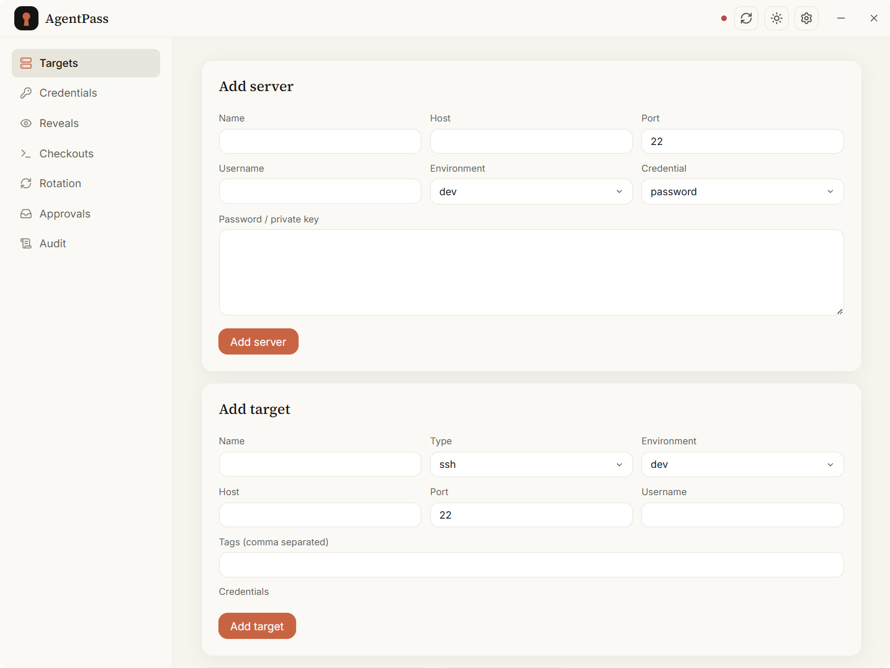
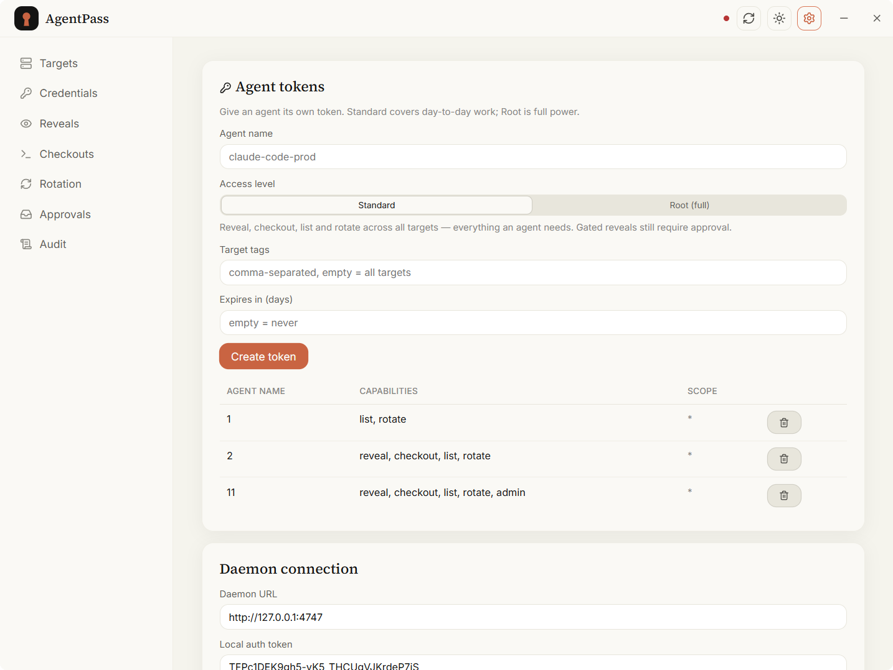

<div align="center">


### 给你的 AI agent 有边界、可审计、会过期的服务器访问权 —— 而不是一段贴出去的密钥。

[](https://github.com/sooua/agentpass/releases)
[](https://github.com/sooua/agentpass/actions/workflows/release.yml)
[](LICENSE)
[](#安装)

[English](README.md) · **中文**

</div>

---

**agentpass** 是为自主编码 agent 时代打造的本地优先凭据管理器。Claude Code、Codex、Cursor Agent 通过它登录你的服务器——拿到的是一把会过期的临时钥匙,而不是被灌进聊天记录的长期密钥。每一次访问都被限定在该 agent 能触及的范围内,归属到它的身份,并写入只追加的审计日志。一切都不离开你的机器。

<div align="center">

</div>

## 为什么用 agentpass

把原始 SSH 私钥或数据库密码交给 AI agent 是一扇单向门:密钥从此留在了对话、shell 历史、模型上下文里。agentpass 关上这扇门。agent 申请的是**访问**,拿到的是定时失效的凭据,自始至终不持有你的长期密钥。

- **Checkout,而非 reveal。** 默认路径签发一条临时、会过期的 `ssh` 命令。私钥仅在本次会话中于本地落地,过期即擦除——agent 从不拿到它。
- **按身份最小授权。** 每个 agent 持有一个受能力、环境、目标限定的 scoped token。越权在请求执行前就被拒,审计日志记录的是 token 身份,而非自报的字符串。
- **刻意保留的高危路径。** 明文 reveal 仍为真正需要的场景保留——全程审计、感知轮换,并以强制的**职责分离**门控审批。
- **本地优先。** SQLite 落盘、AES-256-GCM 密文块、0600 主密钥、操作系统级文件 ACL、脱敏日志。无云账号,无遥测。

## 功能

| | |
|---|---|
| **🔑 凭据 checkout** | 经系统 OpenSSH 客户端签发临时、会过期的 SSH 访问。长期密钥永不离库。 |
| **🎫 Scoped agent 令牌** | 按 能力 × 环境 × 目标 限定的按 agent 令牌。一键"推荐 agent 令牌"预设:保留全部操作能力,不含 admin。 |
| **👁 可审计的 reveal** | 真正需要时才给明文——每次调用入日志、密钥脱敏、按策略触发轮换。 |
| **✅ 带职责分离的审批** | 高危 reveal 需人工审批;申请者永远无法批准自己的请求。 |
| **♻️ 轮换** | reveal 后、N 次 reveal 后、或按周期轮换。感知审批的手动流程;可选自动轮换。 |
| **🔄 端到端加密同步** | 经本地目录、GitHub Gist、WebDAV 或 S3 跨设备同步——密钥离开主机前已加密。 |
| **🧩 适配器优先** | 清晰的 provider 接口,OpenBao、Infisical、Warpgate、JumpServer 可无侵入接入。 |
| **🖥 原生桌面端** | macOS / Windows / Linux 的 Tauri 2 + React 应用,内置签名的应用内更新。 |

<div align="center">
<table>
<tr>
<td width="50%"><br/><sub><b>Scoped agent 令牌</b> —— 把 agent 精确限定在它能做的事上。</sub></td>
<td width="50%"><br/><sub><b>Checkout</b> —— 一条会过期的 SSH 命令,不交出密钥。</sub></td>
</tr>
<tr>
<td width="50%"><br/><sub><b>审批</b> —— 高危 reveal 的职责分离。</sub></td>
<td width="50%"><br/><sub><b>同步</b> —— 跨设备端到端加密。</sub></td>
</tr>
</table>
</div>

## 工作原理

```
┌────────────┐   MCP (stdio)   ┌────────────┐   HTTP (127.0.0.1, Bearer)   ┌──────────────┐
│  AI agent  │ ───────────────▶│ MCP server │ ────────────────────────────▶│    daemon    │
│ Claude/…   │                 │  19 工具   │                              │  AgentPassCore│
└────────────┘                 └────────────┘                              └──────┬───────┘
                                                                                  │
        ┌──────────────┐  自动连接 (conn.json)                              ┌──────┴───────┐
        │  桌面应用    │ ◀─────────────────────────────────────────────── │    SQLite    │
        │  Tauri + UI  │                                                    │ AES-256-GCM  │
        └──────────────┘                                                    └──────────────┘
```

agent 只与 MCP server 通信;daemon 掌管全部密钥材料,且在 checkout 路径上从不返回长期密钥。桌面应用与 daemon 同机运行,仅绑定回环地址。

## 安装

从[最新 Release](https://github.com/sooua/agentpass/releases/latest) 下载对应平台安装包:

| 平台 | 安装包 |
|------|--------|
| macOS | `.dmg`(通用 —— Intel + Apple Silicon) |
| Windows | `.msi` / `.exe` |
| Linux | `.AppImage` / `.deb` |

应用内更新经 GitHub Releases 分发并签名。

<details>
<summary><b>从源码运行</b></summary>

```bash
pnpm install
pnpm build            # tsc -b
pnpm test             # vitest

pnpm daemon           # 本地 API —— 打印 URL + token,写入 ~/.agentpass
pnpm mcp              # MCP stdio server(读 ~/.agentpass/token)
pnpm tauri:dev        # 原生桌面窗口(需 Rust)
```

若本机 `4747` 端口被占,设 `AGENTPASS_PORT=17470`(MCP server 与 UI 用匹配的 `AGENTPASS_URL`)。
</details>

## 接入 agent

把 agent 的 MCP 配置指向 server。token 会自动从 `~/.agentpass/token` 读取——别写进配置。

```json
{
  "mcpServers": {
    "agentpass": {
      "command": "node",
      "args": ["/abs/path/to/agentpass/apps/mcp-server/dist/index.js"],
      "env": { "AGENTPASS_URL": "http://127.0.0.1:4747" }
    }
  }
}
```

然后直接说:

> 用 agentpass checkout `web-01` 的 SSH 访问,然后跑部署。

agent 找到目标、checkout 一条会过期的 SSH 命令、执行它,临时密钥过期自动擦除——全程审计。

> **让 agent 用 scoped token,别用 root。** 建一个带 `reveal` · `checkout` · `list` · `rotate`、**不含** `admin` 的令牌(桌面应用里一键预设),root 留给你自己。保留全部操作能力,但 agent 无法管理令牌、也无法批准自己的受审批 reveal。见 [docs/security-model.md](docs/security-model.md)。

## 安全模型

agentpass 刻意支持向 agent 给出明文——这是产品能力,而非疏漏——并以一系列控制包裹它:请求执行前强制的 scoped token、审批的职责分离、脱敏审计日志、落盘加密、仅回环绑定。完整威胁模型、信任边界,以及那个诚实的局限(持 root 或 `admin` 的 agent 能自制第二身份,故审批仅对无 admin 的 agent 才是真边界),见 **[docs/security-model.md](docs/security-model.md)**。

## 文档

- [架构](docs/architecture.md)
- [安全模型](docs/security-model.md)
- [HTTP API](docs/api.md)
- [MCP 工具](docs/mcp-tools.md)
- [轮换模型](docs/rotation-model.md)

## 状态

首个稳定版(`v1.0.0`)。自动轮换默认关闭——在网关 provider 能把新密钥装到目标之前,计划内与 reveal 后的任务仅被创建、留待手动完成。`ssh_agent_socket` checkout 模式尚未实现;`temp_key_file` 是默认且唯一提供的模式。

## 许可证

[MIT](LICENSE) © 2026 sooua
